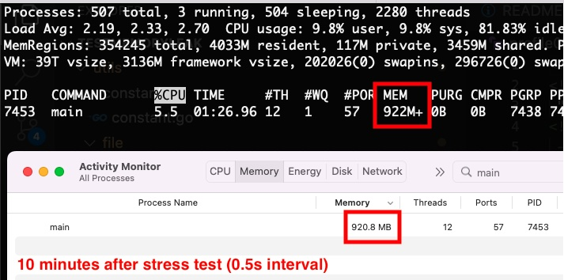

# Documentations
## Description
This documentation explains how to replicate and solve a memory leak case by monitoring the memory and see the result on golang tool pprof.

## Init
   go mod tidy

## Single Test
- terminal 1

      go run main.go

- terminal 2

      curl --request POST localhost:8090/check --data '{"url": "https://freetestdata.com/wp-content/uploads/2021/09/png-5mb-1.png"}'

- terminal 3

      go tool pprof -http=:8091 localhost:6060/debug/pprof/heap

## Multiple Test
- terminal 1

      go run main.go

- terminal 2

      while true; do 
         curl --request POST localhost:8090/check --data '{"url":"https://freetestdata.com/wp-content/uploads/2021/09/png-5mb-1.png"}'
         sleep 0.5
      done

- terminal 3

      go tool pprof -http=:8091 localhost:6060/debug/pprof/heap

## Result

### stress test for about ~5 minutes with 0.5s interval

#### Memory

#### PPROF

##### allocs

##### heap

##### goroutine

### stress test has been stopped for more than ~10 minutes

#### stress test has been stopped for more than ~30 minutes

#### stress test has been stopped for more than ~40 minutes

## Hotfix (Solution)

When we analyze the allocs or heap web tree,
we can see there is a problem with the way we consume http library.

When we check the code,
there is a part of the code where requesting http get on `GetRemoteFileSize`,
we miss to close the response body eventhough it never been used,
so by adding this line `defer resp.Body.Close()` after requesting the http

    resp, err := http.Get(*url)
    if err != nil {
        return nil, err
    }

    defer resp.Body.Close() // Adds this line to solve memory leak.
    
    if resp.StatusCode != http.StatusOK || resp.ContentLength < 0 {
        return nil, errors.New("REMOTE_FILE_INACESSIBLE")
    }

## Hotfix Result

### stress test for about ~15 minutes with 0.5s interval

